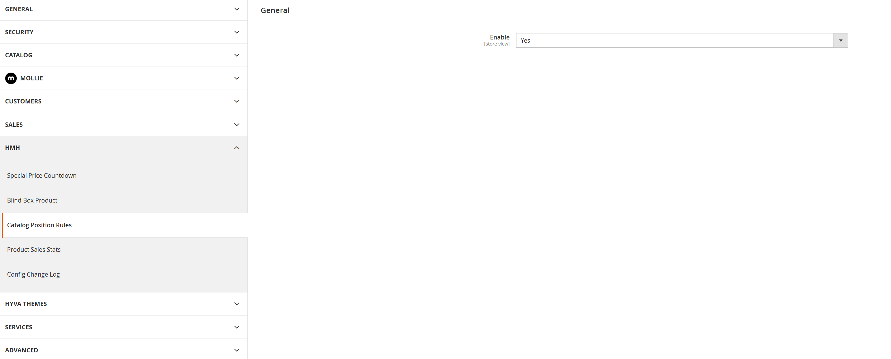
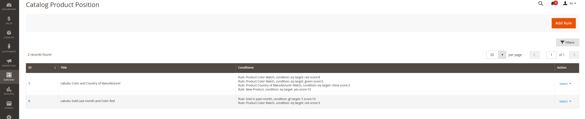
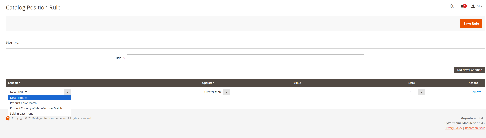
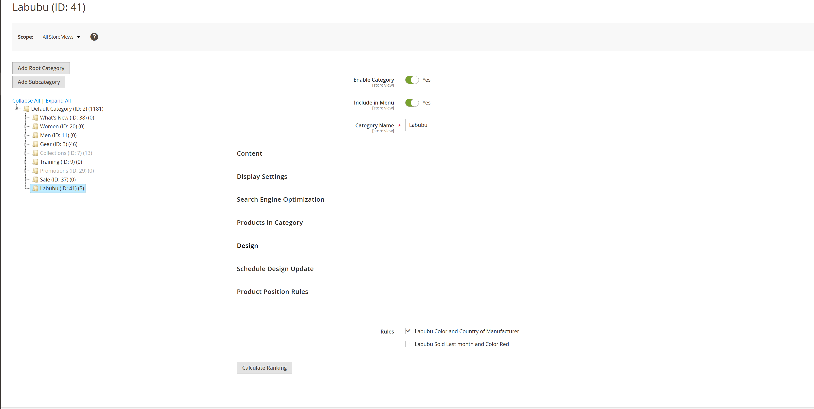
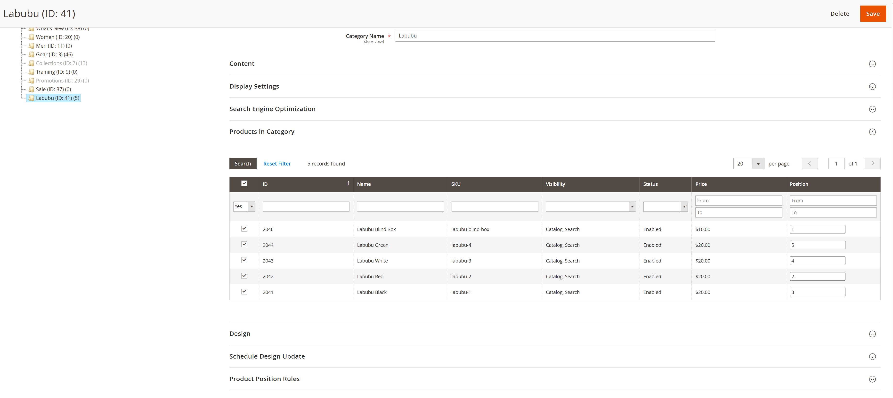
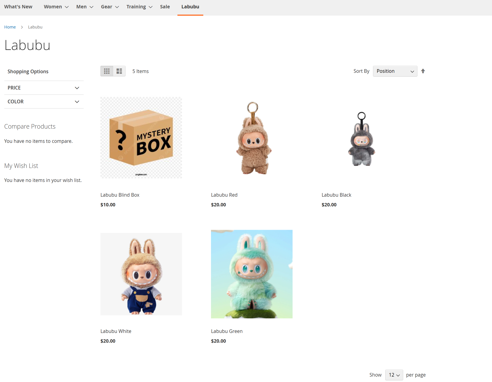

## Hmh_CatalogPositionRules

Catalog Position Rules lets admins define scoring rules and re-rank products in a category based on those rules.

### Features
- Define multiple conditions with operators and scores.
- Calculate ranking for a category and apply the new product positions.
- Optional attribute-based conditions (e.g., color) via virtual types.
- Create scored based category product position rule with multiple condition with score assigned.
- Assign rule to a category and validate products under this category with all conditions, when condition match scored is added to product accordingly.
- Products position is re-assigned to display product with highest score first, makes managing category product display with one click.

### Configuration
- Admin path: Stores > Configuration > HMH > Catalog Position Rules
- Setting: Enable/Disable module behavior

### Usage
1. Create a rule under Catalog Position Rules.
2. Open a category, select a rule, and click "Calculate Ranking".
3. Reindex if needed to see storefront updates.

### Screenshots

Enable the module to show the rules fieldset on the category edit page.

Create a new rule with conditions, operators, values, and scoring.

Combine multiple conditions in a single rule for richer scoring logic.

Assign the rule to a category and run the ranking calculation.

Review the updated product positions after calculation.

Reindex and confirm the storefront shows products ordered by score.

### Add new ranking condition
1. Create a class implementing `Hmh\CatalogPositionRules\Api\RuleConditionInterface`.
2. Implement the condition logic in `isConditionMatch()`.
3. Register the class in `Hmh\CatalogPositionRules\Model\RuleConditionsPool` via `app/code/Hmh/CatalogPositionRules/etc/di.xml`.
